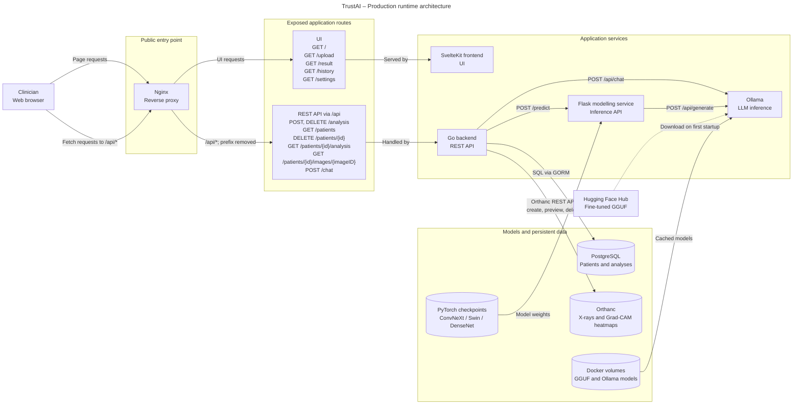

# Production Architecture as FLowchart

```mermaid
---
title: TrustAI – Production runtime architecture
---

flowchart LR
    user["Clinician<br/>Web browser"]

    subgraph edge["Public entry point"]
        nginx["Nginx<br/>Reverse proxy"]
    end

    subgraph app["Application services"]
        frontend["SvelteKit frontend<br/>UI"]
        backend["Go backend<br/>REST API "]
        modelling["Flask modelling service<br/>Inference API"]
        ollama["Ollama<br/>LLM inference"]
    end

    subgraph routes["Exposed application routes"]
        uiRoutes["UI<br/>GET /<br/>GET /upload<br/>GET /result<br/>GET /history<br/>GET /settings"]
        apiRoutes["REST API via /api<br/>POST, DELETE /analysis<br/>GET /patients<br/>DELETE /patients/{id}<br/>GET /patients/{id}/analysis<br/>GET /patients/{id}/images/{imageID}<br/>POST /chat"]
    end

    subgraph persistence["Models and persistent data"]
        postgres[("PostgreSQL<br/>Patients and analyses")]
        orthanc[("Orthanc<br/>X-rays and Grad-CAM heatmaps")]
        checkpoints[("PyTorch checkpoints<br/>ConvNeXt / Swin / DenseNet")]
        modelVolumes[("Docker volumes<br/>GGUF and Ollama models")]
    end

    huggingFace["Hugging Face Hub<br/>Fine-tuned GGUF"]

    user -->|"Page requests"| nginx
    user -->|"Fetch requests to /api/*"| nginx
    nginx -->|"UI requests"| uiRoutes
    uiRoutes -->|"Served by"| frontend
    nginx -->|"/api/*; prefix removed"| apiRoutes
    apiRoutes -->|"Handled by"| backend
    backend -->|"SQL via GORM"| postgres
    backend -->|"Orthanc REST API<br/>create, preview, delete"| orthanc
    backend -->|"POST /predict"| modelling
    backend -->|"POST /api/chat"| ollama
    modelling -->|"POST /api/generate"| ollama
    checkpoints -->|"Model weights"| modelling
    huggingFace -.->|"Download on first startup"| ollama
    modelVolumes -->|"Cached models"| ollama

```