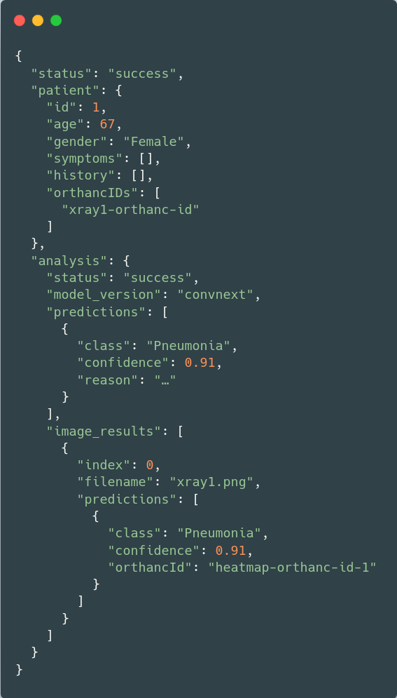

# Backend
Basic documentation about the backend and how the frontend, classifier, and LLM communicate with it is provided in the [General Project README](/README.md).

[This Mermaid sequence diagram](/backend/sequence_diagramm_start_analysis.md) showcases how the backend communicates with the other components in this project for the use case of uploading patient data and starting an analysis. This diagram shows the inner workings of the backend quite well.

An example reponse for POST /api/analysis (request that starts the analysis) is as follows: 



## Structure of the backend

The backend is structured as a [layered architecture](#layered-architecture) that sends requests that come to the backend usually first to a handler, then to a service, and finally to a repository or client. The handlers are the HTTP layer that translates HTTP requests into service calls that can be understood by the backend. The services contain business and orchestration logic and communicate with the repositories. The repositories do not contain any business logic and instead communicate with the database. For this, they use GORM, which is an ORM library for Go. For more information about ORM, see [ORM](#orm). Orthanc communication is handled through its internal REST API.
Some directories contain files that are named the same as those directories. These files contain types and structs.

The main.go file is located under /cmd/server and acts as a starting point for the backend that initializes the database, reads configuration files, injects dependencies into the components, and starts the HTTP server on the configured port.

Under backend/internal/api/handler.go, all registered API routes can be seen with their respective OpenAPI documentation. The _type.go files contain API request and response types.

The rest of the backend code also resides in the /internal directory.
Each directory under internal is its own package, and the packages are separated into different logical technical ("fachliche") use cases. Functions in a file that are contained in one package and that you want to import and use in a file that is located in another package must be imported into that other package as a whole package. You cannot import individual files or functions.
Functions that can be exported start with a capital letter, and those that can only be used internally with a lowercase letter. Go does not use classes but structs.

The REST API is documented in the /docs directory using the OpenAPI standard and Swagger, and it is directly used by the frontend.

## Contributing

### Prerequisites

1. Install Go as instructed here: [https://go.dev/doc/install](https://go.dev/doc/install)
2. Run
```bash
go mod tidy
```
to install all dependencies.
3. You may have to write ``export PATH=$PATH:$(go env GOPATH)/bin`` into your .bashrc

### Testing the Backend

Tests in Go have the "_test" suffix. The general Go convention is to have one test file for every normal Go file that exists, but this repository does not follow this convention for all files, as not all files contain testable logic, such as a patient.go file that only consists of types. Many tests are set up with a temporary SQLite database to avoid needing the whole Docker setup for tests.

To test the backend, run:

```bash
go test ./...
```
Alternatively, if you are using VS Code and have installed Go language support, right-click the internal folder and click "Run Tests."

### Update the API with Swagger
Changing the API in any way requires you to update the API specification and documentation. To do this, run the following command in the backend folder:

 ```bash
 swag init --dir ./cmd/server,./internal/api --output ./docs
 ```
Changing the API in the backend may require you to also make changes in the frontend.

## Concepts

### Layered Architecture
A software architecture style that structures software in layers. One layer can only ever communicate with the layer above or below. All service.go files form one layer, for example.

### ORM
Object-relational mapping is a strategy with which object-oriented programming structures can be mapped to relational database structures.
This mapping has to be done because relational databases store object information in data tables, while Go stores object information in structs, which cannot be automatically mapped to data tables without additional help.