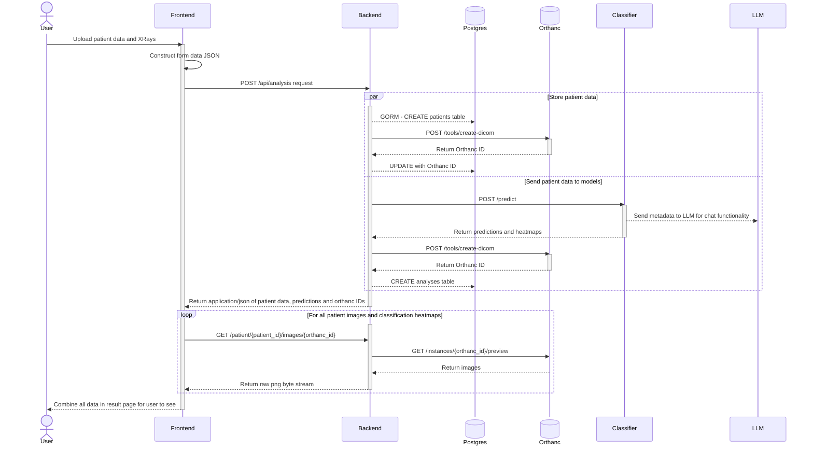

## Example Use Case: Upload patient data and X-Ray images and start the analysis

```mermaid
sequenceDiagram
        actor User
      
        participant Frontend
        participant Backend
        participant Postgres@{ "type" : "database" }
        participant Orthanc@{ "type" : "database" }
        participant Classifier
        participant LLM

        User ->> Frontend: Upload patient data and XRays
        
        activate Frontend
        Frontend ->> Frontend: Construct form data JSON
        Frontend ->> Backend: POST /api/analysis request
        
        par Store patient data
        activate Backend
        Backend -->> Postgres: GORM - CREATE patients table
        Backend ->> Orthanc: POST /tools/create-dicom
        activate Orthanc
        Orthanc -->> Backend: Return Orthanc ID
        deactivate Orthanc
        Backend -->> Postgres: UPDATE with Orthanc ID

        and Send patient data to models 
        Backend ->> Classifier: POST /predict
        activate Classifier
        Classifier -->> LLM: Send metadata to LLM for chat functionality
        Classifier -->> Backend: Return predictions and heatmaps
        deactivate Classifier
        Backend ->>  Orthanc: POST /tools/create-dicom
        activate Orthanc
        Orthanc -->> Backend: Return Orthanc ID
        deactivate Orthanc
        Backend -->> Postgres: CREATE analyses table
        end

        Backend -->> Frontend: Return application/json of patient data, predictions and orthanc IDs
        deactivate Backend
        
        loop For all patient images and classification heatmaps
        activate Backend
        Frontend ->> Backend: GET /patient/{patient_id}/images/{orthanc_id}
        Backend ->> Orthanc: GET /instances/{orthanc_id}/preview
        Orthanc -->> Backend: Return images
        Backend -->> Frontend: Return raw png byte stream
        deactivate Backend
        end
        
        Frontend -->> User: Combine all data in result page for user to see
        deactivate Frontend
```