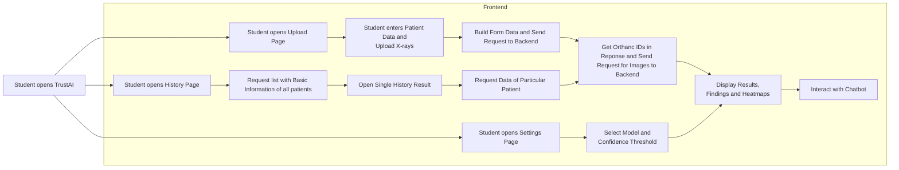

```mermaid
flowchart LR
 subgraph frontend["Frontend"]
        settingspage["Student opens Settings Page"]
        uploadpage["Student opens Upload Page"]
        upload["Student enters Patient Data and<br>Upload X-rays"]
        api["Build Form Data and Send Request to Backend"]
        api2["Get Orthanc IDs in Reponse and Send Request for Images to Backend"]
        result2["Display Results,<br>Findings and Heatmaps"]
        chat["Interact with Chatbot"]
        history["Student opens History Page"]
        historyall["Request list with Basic Information of all patients"]
        historysingle["Request Data of Particular Patient"]
        history2["Open Single History Result"]
        settings["Select Model and<br>Confidence Threshold"]
  end
    user["Student opens TrustAI"] --> history & settingspage & uploadpage
    upload --> api
    result2 --> chat
    api --> api2
    history --> historyall
    api2 --> result2
    settings --> result2
    historyall --> history2
    history2 --> historysingle
    historysingle --> api2
    settingspage --> settings
    uploadpage --> upload
```