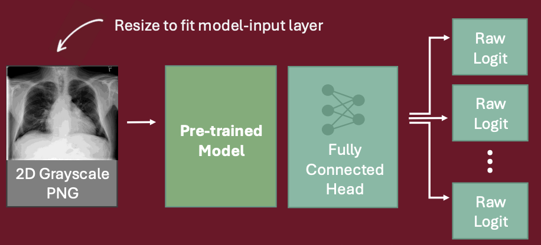

# Model Training

Fine-tunes multi-label chest X-ray classifiers for 15 findings on the hybrid
NIH + MIDRC dataset. `train.py` is the single entry point for every backbone —
the architecture is chosen with `--model`, everything else is shared.



Input PNG → preprocessing → ImageNet-pretrained backbone → fully connected head
(`Linear → 15`) → one sigmoid score per finding. Only the head is randomly
initialized; the backbone is pre-trained and fine-tuned at a lower learning rate.

## Task and dataset

The 15 output classes, in `ALL_CLASSES` order (this order is the output order of
the model and the key order of every prediction payload):

`Atelectasis`, `Cardiomegaly`, `Consolidation`, `Edema`, `Effusion`,
`Emphysema`, `Fibrosis`, `Hernia`, `Infiltration`, `Mass`, `Nodule`,
`Pleural_Thickening`, `Pneumonia`, `Pneumothorax`, `Covid`

| Property | Value |
|----------|-------|
| Labels | 15 findings, multi-label (`ALL_CLASSES` in `train.py`), BCE-with-logits |
| Master CSV | `data_hybrid/combined_master.csv` — 100,758 images / 35,700 patients |
| Sources | 93,949 NIH ChestX-ray14 (fully labelled) + 6,809 MIDRC COVID-19 (Covid label only) |
| Split | by **patient**, stratified on `Covid`+`Effusion`, 80 / 10 / 10 train / val / test, `random_state=42` |
| Corrupt data | rows listed in `data_hybrid/bad_images.tsv` are dropped at load time |

Splitting on `patient_id` (not on rows) keeps every study of a patient inside a
single split, so no patient leaks between train, val and test.

### Partial labels and the masked loss

MIDRC images are only annotated for Covid; a `0` in the other 14 columns means
*unknown*, not *verified negative*. `train.py` therefore builds a per-sample
`mask` (1 = label known, 0 = unknown) and the models use
`masked_loss_fn()`, which zeroes masked entries before averaging:

```
loss = Σ(bce_with_logits × mask) / Σ(mask)
```

Without this, every MIDRC image would teach the model that Covid-positive
patients never have pneumonia or effusion. The same mask is applied to the
validation AUC, so unknown labels never count as negatives.

## Models

All backbones are ImageNet-pretrained `torchvision`/`timm` models with the
classification head replaced by a `Linear → 15` layer, wrapped in a
`pl.LightningModule` (per-class AUROC + `configure_optimizers`). The shared
pipeline is drawn in [`training_architecture.png`](training_architecture.png);
only the backbone in the table below changes.

| `--model` | Class (file) | Backbone / pre-training | `INPUT_SIZE` | `BATCH_SIZE` | Checkpoint |
|-----------|--------------|--------------------------|--------------|--------------|------------|
| `convnext` (default) | [`ChestModel`](models/chest_model.py) | ConvNeXt-Base, ImageNet-1K | 384 | 32 | `checkpoints/covnext348.pth` |
| `convnext21k` | [`ConvNext21KChestModel`](models/chest_model.py) | ConvNeXt-Base, ImageNet-21K (timm `fb_in22k`) | 224 | 32 | `checkpoints/convnext21k-224px_final.pth` |
| `swin` | [`SwinTransformerChestModel`](models/ViT_model.py) | Swin-B, ImageNet-1K | 224 | 24 | `checkpoints/swin-224px_final.pth` |
| `densenet` | [`DenseNetChestModel`](models/densenet_model.py) | DenseNet-121 (CheXNet-style) | 224 | 32 | `checkpoints/densenet-224px_final.pth` |

`BATCH_SIZE` is what each model recommends, but `config["batch_size"] = 16`
overrides all of them — 16 is what the shipped checkpoints were trained at. The
same ids are registered for serving in
[`services/model-api/models_registry.py`](../../../services/model-api/models_registry.py)
(`convnext21k` is served as a member of `convnext_ensemble`).

## Variable input resolution

`config["resolution"]` is `None` by default, which means *take the resolution
from the selected model*:

```python
MODEL_CLASS = _select_model_class(ARGS.model or os.environ.get("TRAIN_MODEL", "convnext"))
RESOLUTION   = config["resolution"] if config["resolution"] else MODEL_CLASS.INPUT_SIZE
BATCH_SIZE   = config["batch_size"]   if config["batch_size"]   else MODEL_CLASS.BATCH_SIZE
```

- Each model class declares `INPUT_SIZE` / `BATCH_SIZE` as class attributes, so
  the geometry travels *with the architecture* instead of being hardcoded in the
  training script. Swin, DenseNet and the 21K ConvNeXt keep the 224 px grid they
  were pre-trained on (their relative-position bias / patch grid was tuned
  there); the fully convolutional ConvNeXt can take 384 px for more detail.
- `RESOLUTION` is then the single source for the `ResizeLongest` / `SquarePad`
  transforms, so the tensor shape can never drift from what the backbone expects.
- The serving side must use the same value — see the
  [model README](../README.md#how-the-model-is-integrated-into-the-app).
- Override for experiments: `--resolution 512`, `--batch-size 8`, `--epochs 10`.
  A resolution that does not match the serving `INPUT_SIZE` yields a checkpoint
  that must be served with the same override.

## Preprocessing

```
ResizeLongest(RESOLUTION) ──► SquarePad(fill=0) ──► [train only] flip / rotate 5° /
affine ──► ToTensor ──► Normalize(dataset_stats.json)
```

- `ResizeLongest` scales the **longer** side to `RESOLUTION` and keeps the aspect
  ratio, so anatomy (e.g. cardiothoracic ratio) is never squashed; `SquarePad`
  then adds a symmetric black border, because air outside the body is black on a
  radiograph. Every output is exactly `RESOLUTION × RESOLUTION`, so batches stack.
- Train-only augmentation: `RandomHorizontalFlip`, `RandomRotation(5, fill=0)`,
  `RandomAffine(translate=(0.1, 0.05), scale=(0.85, 1.15), shear=5, fill=0)`.
  Validation uses geometry + normalization only.
- `dataset_stats.json` holds the dataset mean/std (`0.4969` / `0.2517`,
  computed by [`compute_dataset_stats.py`](compute_dataset_stats.py)). If the
  file is missing, training silently falls back to ImageNet stats — run the
  script first.

## Training setup

| Setting | Value |
|---------|-------|
| Optimizer | AdamW, `weight_decay=1e-2`, two param groups |
| Learning rates | head `1e-4`, backbone `1e-5` (`backbone_factor = backbone_lr / classifier_lr`) |
| Scheduler | `CosineAnnealingLR(T_max=epochs, eta_min=1e-6)`, stepped once per epoch |
| Class imbalance | `pos_weight = sqrt(neg / pos)` per class, computed on the train split |
| Loss | masked BCE (see above) |
| Epochs | `config["epochs"] = 5`, plus an **epoch 0 baseline validation pass** before any weight update |
| Stability | non-finite loss → batch skipped; `clip_grad_norm_(max_norm=1.0)` |
| Checkpoints | `temp_checkpoint.pth` each epoch, final weights to `--output` (default `checkpoint.pth`) |
| Tracking | W&B project `hybrid-xray-covid`; logs val loss, macro AUC and per-class AUC |
| Device | CUDA → MPS → CPU; MPS memory pool capped via `PYTORCH_MPS_*_WATERMARK_RATIO` |

## How to run

```bash
# 1. one-off dataset statistics (must match the resolution you train at)
python ml/model/train/compute_dataset_stats.py --csv data_hybrid/combined_master.csv

# 2. pre-downscale the full-res MIDRC PNGs (~48 GB) once
python ml/model/construct_data/fix/resize_midrc.py

# 3. train (default: ConvNeXt-Base at 384 px)
python ml/model/train/train.py --model convnext --epochs 5 --output checkpoints/convnext-384px.pth
python ml/model/train/train.py --model swin --epochs 2 --output checkpoints/swin-224px_final.pth
```

`TRAIN_MODEL`, `TRAIN_WORKERS` and `WANDB_RUN_NAME` can be set instead of the
matching flags. Workers default to `1`: each worker imports torch (~250 MB) and
the 24 GB unified memory is shared with MPS, so more workers plus full-res
decodes previously pushed the machine into swap.

## Results

Macro AUC on the held-out test patients (10,151 images, 3,570 patients never
seen in training), measured by
[`evaluate_models.py`](../evaluate/evaluate_models.py):

| Model | macro AUC | micro AUC |
|-------|-----------|-----------|
| convnext | 0.855 | 0.889 |
| swin | 0.849 | 0.887 |
| densenet | 0.842 | 0.882 |
| ensemble (convnext + swin + densenet) | 0.858 | 0.893 |

Two caveats when reading these numbers:

- `Covid` reaches **AUC 1.0** and should not be read as a clinical result. Every
  Covid positive is a MIDRC image and every negative an NIH image, so the model
  can separate the two sources instead of the pathology. It is a property of
  this dataset blend.
- Per-condition AUROC, precision/recall and the tuned clinical metrics are in
  the [evaluate README](../evaluate/README.md).

Thresholds are not applied by the service: `/predict` returns the raw sigmoid
per class, and what the UI shows is decided by the decision-mode setting
(frontend, τ = 0.2 / 0.5 / 0.8 or custom).
[`tune_thresholds.py`](../evaluate/tune_thresholds.py) explores per-class
thresholds tuned on `val`, which is what the low precision *and* recall at
τ = 0.5 reflect.

## Related scripts

| Script | Purpose |
|--------|---------|
| [`compute_dataset_stats.py`](compute_dataset_stats.py) | dataset mean/std for `Normalize` |
| [`../construct_data/blend_data.py`](../construct_data/blend_data.py) | builds `combined_master.csv` (NIH balanced + orientation-fixed MIDRC) |
| [`../construct_data/fix/resize_midrc.py`](../construct_data/fix/resize_midrc.py) | pre-downscales MIDRC PNGs to ~1024 px long side |
| [`../construct_data/fix/fix_midrc_orientation.py`](../construct_data/fix/fix_midrc_orientation.py) | normalizes MIDRC orientation |
| [`../evaluate/evaluate_models.py`](../evaluate/evaluate_models.py) | per-class AUROC on the test split |

`train.py` drives the training loop itself rather than using `pl.Trainer`, so the
`training_step` / `validation_step` methods on the model classes exist for
Lightning compatibility only.
